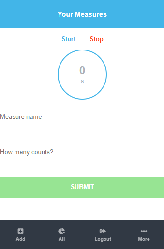
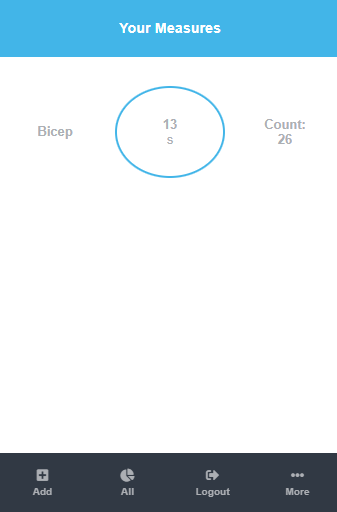
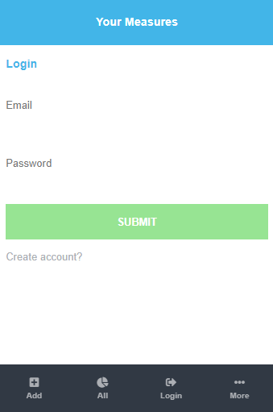

# Your Measures
### [Tracking App](https://www.notion.so/Final-Capstone-Project-Tracking-App-22e454da738c46efaf17721826841772)
> This is a measurements app that allows users to calculatoe their number of counts on whatever they're trying to measure.

  
   

## Built With

- Javascript
- React
- Redux
- babel, css, eslint, stylelint, jest

## Live Demo

[See project](https://quotexquote.herokuapp.com/)

## Getting Started

To get a local copy up and running follow these simple example steps.

- Open your terminal
Then run the following command line
- `git clone https://github.com/MahmoudBakr23/quoteXquote.git`
Then run the following command line
- `cd quoteXquote`
Then install the required npm packages to run the app
- `npm i`
Then run this command line to start the app
- `npm start`

### Run tests
To run the tests type this command line in the terminal
- `npm test`

## Authors

👤 **Mahmoud Bakr**

- GitHub: [@githubhandle](https://github.com/MahmoudBakr23)
- LinkedIn: [LinkedIn](https://www.linkedin.com/in/m-bakr/)

## 🤝 Contributing

Contributions, issues, and feature requests are welcome!

Feel free to check the [issues page](https://github.com/MahmoudBakr23/quoteXquote/issues).

## Show your support

Give a ⭐️ if you like this project!

## Acknowledgments

- [animechan](https://animechan.vercel.app/)
- [jikan](https://jikan.docs.apiary.io/#)
- [Microverse](https://www.microverse.org/)

## 📝 License

License free.